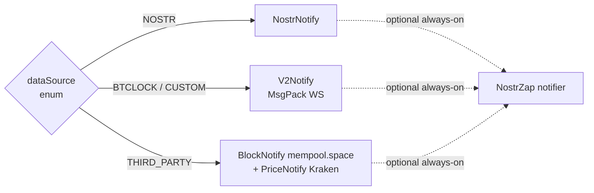

# Architecture

The firmware is an ESP32-S3 Arduino-as-an-ESP-IDF-component project built
with PlatformIO. It drives up to 8 e-paper displays through one or two
MCP23017 GPIO expanders, a ring of NeoPixel LEDs, an optional
PCA9685-driven frontlight, and an optional BH1750 ambient light sensor.
It exposes a small HTTP + Server-Sent-Events API and a SvelteKit WebUI
(built separately and uploaded as a LittleFS image).

## Tree layout

After the 3.4.0 reorganisation (Phase 3.5), the code under `src/lib/` is
grouped by concern rather than dumped flat. Each group is one directory
and each directory is responsible for one cross-cutting concern:

```
src/
├── main.cpp                   # PlatformIO entry, loop(), watchdogs
├── fonts/                     # Compressed bitmap fonts (PSRAM targets)
├── img/                       # Static bitmap assets (icons)
└── lib/
    ├── data_sources/          # Everything that fetches or listens for
    │   ├── block_notify.*       #   upstream data. Implements the
    │   ├── price_notify.*       #   LiveService interface so the main-
    │   ├── v2_notify.*          #   loop watchdog can iterate them
    │   ├── nostr_notify.*       #   generically.
    │   ├── bitaxe_fetch.*
    │   ├── mining_pool_stats_fetch.*
    │   ├── mining_pool/         # pool-specific adapters + logos
    │   ├── live_service.*       # abstract base + registry
    │   └── …
    ├── drivers/               # Hardware-facing glue
    │   ├── epd/                 #   GxEPD2 wrappers + renderText/Icon/QR
    │   ├── buttons/             #   MCP23017 + debounce + ISR → task
    │   └── leds/                #   NeoPixel + PCA9685 frontlight + DND
    ├── ui/                    # Higher-level screen composition
    │   └── screen_handler.*     #   Screen rotation, custom text, queue
    ├── system/                # Process-wide plumbing
    │   ├── config.*             #   boot sequence, NVS migration
    │   ├── defaults.hpp         #   DEFAULT_* compile-time constants
    │   ├── pref_keys.hpp        #   PrefKeys:: NVS key inventory
    │   ├── shared.*             #   HttpHelper, SHA256, global state
    │   └── timers.*             #   minute/screen-rotate timers + ISR
    ├── net/
    │   ├── webserver/           # One file per REST concern:
    │   │   ├── webserver.*        #   setup, auth gate, CORS, static
    │   │   ├── internal.hpp       #   module-private header
    │   │   ├── routes that-register: status / settings / actions /
    │   │   │   lights / dnd / ota_routes
    │   │   └── OneParamRewrite.*  #   path → query rewrite helper
    │   └── ota/                 # OTA: web upload, ArduinoOTA, streamed
    │       └── ota.*             #   firmware/LittleFS update handlers
    └── util/                  # Header-only utilities
        └── gzip_decompressor.hpp

lib/
├── btclock/                   # Project-private "library" that also
│   │                          # links into native_test_only so unit
│   │                          # tests can exercise this code without
│   │                          # Arduino at all.
│   ├── utils.*                  #   number formatters, bolt11, hashrate
│   ├── data_handler.*           #   screen text composition
│   ├── bitaxe_handler.*
│   ├── nostrdisplay_handler.*
│   └── dnd_window.*             #   pure DND time-range algebra
└── qrcode/                    # Upstream qrcodegen, unmodified

test/
├── test_utils/                #   utils.hpp
├── test_datahandler/          #   data_handler.hpp
├── test_bitaxehandler/        #   bitaxe_handler.hpp
├── test_nostrdisplay/         #   nostrdisplay_handler.hpp
├── test_mining_pool/          #   pool adapters
├── test_dnd_window/           #   dnd_window.hpp        (added in 3.4.0)
└── test_pref_keys/            #   pref_keys.hpp         (added in 3.4.0)
```

Things that are intentionally left flat:

- `src/main.cpp` is the PlatformIO entry point and can't move.
- `src/fonts/` and `src/img/` are already logically grouped.
- `lib/btclock/` is a PlatformIO library root at the repo level; renaming
  it would also move the `lib_deps` resolution boundary.
- `lib/qrcode/` is vendored from upstream.

## Data-source model

The device has three functional data-source modes, selected by the NVS
key `dataSource` (values match the `DataSourceType` enum in
[`src/lib/system/defaults.hpp`](../src/lib/system/defaults.hpp)):



- `BTCLOCK_SOURCE` and `CUSTOM_SOURCE` both run `V2Notify` over an
  MsgPack WebSocket. They only differ in the endpoint string (`ceEndpoint`).
  The legacy `customEndpoint` NVS key was retired in 3.4.0; the one-shot
  migration was removed too, so fresh installs have no compatibility baggage.
- `NOSTR_SOURCE` runs `NostrNotify`.
- `THIRD_PARTY_SOURCE` runs `BlockNotify` (mempool.space WS) and
  `PriceNotify` (Kraken WS) in parallel.

The **Nostr Zap notifier** can additionally run on top of any mode; it
is a separate, always-on feed for Lightning zap events.

All live feeds — V2, Nostr, Block, Price, Bitaxe poll, Mining-pool-stats
poll — implement the `LiveService` interface
([`src/lib/data_sources/live_service.hpp`](../src/lib/data_sources/live_service.hpp))
and register themselves with the process-wide `LiveServiceRegistry`
during `setupDataSource()`. The main loop calls
`LiveServiceRegistry::instance().monitor()` every ~5 s, which drives the
same disconnect / staleness watchdog over every active feed. Before
3.4.0 this was hard-coded to BlockNotify + PriceNotify, so BTClock and
Nostr sources had no app-level watchdog at all.

**TLS handshake serialisation.** Every WS-based data source runs its
own `WebSocketsClient.loop()` pump task, and each of those pumps owns a
separate mbedtls SSL context. The convention each task must follow —
see the existing implementations in `block_notify.cpp`,
`price_notify.cpp`, `v2_notify.cpp`, and `nostr_notify.cpp` — is to
take `tls_gate::mutex()` **only when the socket is not already
connected**:

```cpp
if (wsClient.isConnected()) {
    wsClient.loop();
} else {
    std::lock_guard<std::mutex> lk(tls_gate::mutex());
    wsClient.loop();
}
```

This keeps the steady-state event pump lock-free while forcing every
TLS handshake (boot, reconnect, network flap) to happen sequentially
with every other TLS user — including the HTTPS pollers that go
through `HttpHelper::beginScoped()`. Any new always-on WS data source
must follow the same pattern; a `loop()` that unconditionally holds
the mutex would serialise idle event pumping across tasks and regress
throughput.

**Kraken price subscription shape.** `PriceNotify` builds its
subscribe frame from the comma-separated `actCurrencies` NVS string,
then dispatches incoming ticker frames into the per-currency bucket by
parsing `BTC/<code>` from Kraken's `symbol` field. Before this, only
BTC/USD was requested, so the THIRD_PARTY data source silently left
every non-USD price screen showing whatever was last loaded from NVS.
The CSV parser lives in `data_sources/price_policy.hpp` and is unit-
tested natively.

## Main loop and tasks

`src/main.cpp` is deliberately short. It does three things on a 5-second
cadence:

1. Ping the event-source task so SSE clients get a fresh status frame.
2. Drive the optional frontlight based on the BH1750 light level.
3. Run the Wi-Fi reconnect + data-source watchdog loop.

Everything else runs on its own FreeRTOS task:

| Task                | Source                                                    | Purpose                                      |
| ------------------- | --------------------------------------------------------- | -------------------------------------------- |
| `v2DispatchTask`    | `data_sources/v2_notify.cpp`                              | V2 MsgPack WS dispatch                        |
| `blockNotifyTask`   | `data_sources/block_notify.cpp`                           | mempool.space WS pump (cooperative `stop()`) |
| `priceNotifyTask`   | `data_sources/price_notify.cpp`                           | Kraken WS pump                                |
| `nostrTask`         | `data_sources/nostr_notify.cpp`                           | Nostr relay subscription                      |
| `bitaxeFetchTask`   | `data_sources/bitaxe_fetch.cpp`                           | HTTP poll                                    |
| `miningPoolFetch`   | `data_sources/mining_pool_stats_fetch.cpp`                | HTTP poll                                    |
| `updateDisplayTask` | `drivers/epd/epd.cpp` (via `ui/screen_handler.cpp` queue) | GxEPD2 frame writes                          |
| `ledTask`           | `drivers/leds/led_handler.cpp`                            | NeoPixel effects                             |
| `buttonTask`        | `drivers/buttons/button_handler.cpp`                      | debounced MCP input (no mutex across delays) |
| `eventSourceTask`   | `net/webserver/webserver.cpp`                             | SSE broadcast drain                          |
| `otaTask`           | `net/ota/ota.cpp` (on demand)                             | streamed OTA download + `Update.write()`     |

### ISR layout

The two recurring timers (`minuteTimerISR`, `screenRotateTimerISR` in
`system/timers.cpp`) run in IRAM. They must not dereference flash-resident
singletons or take mutexes, so the task handles they notify are cached in
non-volatile `static volatile TaskHandle_t` at setup time and null-checked
before `vTaskNotifyGiveFromISR`. Any future ISR needs to follow the same
pattern.

### Mutexes

| Mutex             | Where defined                                          | Protects                                 |
| ----------------- | ------------------------------------------------------ | ---------------------------------------- |
| `mcpMutex`        | `system/shared.cpp`                                    | MCP23017 I2C access (buttons + EPD pins) |
| `displayMutexes`  | `drivers/epd/epd.cpp`                                  | Per-panel GxEPD2 state                   |
| `updateMutex`     | `net/ota/ota.cpp`                                      | "an OTA is in progress" flag             |
| `priceMapMutex`   | `data_sources/price_notify.cpp` (3.4.0)                | `currencyMap`, `lastUpdateMap`            |
| `tls_gate::mutex()` | `system/tls_gate.hpp`                                | TLS handshakes across HttpHelper + every WS client. Every mbedtls SSL context takes ~16 KB of IN buffer + scratch; without this gate the initial-burst moment where mempool WS + Kraken WS + Nostr WS + bitaxe HTTPS + mining-pool HTTPS all try to hand-shake concurrently reliably OOMs mbedtls. The gate forces one handshake at a time. |

`BlockNotify` exposes several `std::atomic` statics (`currentBlockHeight`,
`blockMedianFee`, `notifyInit`, `wsConnected`, `lastBlockUpdate`) in
place of mutex-guarded ones. These are only written by the WS pump task
and read by everyone else, so a single lock-free slot per value is
enough.

### V8 caveat (8-panel prototype)

On the V8 board the EPD CS / BUSY / RESET pins route through the MCP
expanders instead of the ESP's native GPIO. The I2C transaction cost of
a frame update is therefore non-trivial and `mcpMutex` contention is
materially worse than on Rev B. The button task and config MCP reads
already release `mcpMutex` across their delays; any new `mcpMutex` user
needs to keep its critical section short to not starve EPD frame
writes.

## HTTP API layout

See [API.md](API.md) for the authoritative list. The short version:

- **One folder, one concern.** `src/lib/net/webserver/` contains one
  registration function per concern (`registerStatusRoutes`,
  `registerSettingsRoutes`, `registerActionRoutes`,
  `registerLightsRoutes`, `registerDndRoutes`, `registerOtaRoutes`),
  each implemented in its own `.cpp`. `webserver.cpp` itself only sets
  up the server, CORS, auth, SSE, and mDNS.
- **One auth gate.** `requireHttpAuth()` is the single source of truth
  for "is HTTP Basic auth enabled and did the caller pass it?"
  `routes that-register` call it at the top of every handler that
  mutates state or reveals secrets.
- **One status builder.** `buildStatusJson()` in
  `net/webserver/status.cpp` is reused by both `GET /api/status` and
  the SSE `status` event, so the WebUI sees a single shape.
- **REST verbs.** State-changing endpoints are POST, read-only
  endpoints are GET, settings updates are `PATCH /api/settings`. The
  legacy `PATCH /api/json/settings` URL is gone in 3.4.0.

## Preferences (NVS)

NVS key strings are centralised in
[`src/lib/system/pref_keys.hpp`](../src/lib/system/pref_keys.hpp) under
`namespace PrefKeys`. Hard-coded `"stringLiteral"` keys are a code-review
red flag since 3.4.0. See [PREFERENCES.md](PREFERENCES.md) for the full
policy (15-character NVS name cap, WebUI compatibility contract, etc.)
and [TESTING.md](TESTING.md#pref-keys) for the CI guard that enforces it.

## Security posture

Deliberately narrow — the device targets a trusted LAN:

- **HTTP Basic auth** is opt-in per install (`httpAuthEnabled`) and
  gates every state-changing endpoint, plus SSE, status, identify,
  frontlight, DND, and lights reads when enabled.
- **`/api/settings` GET never returns plaintext passwords.** It returns
  `httpAuthPassSet: bool` and `otaPassSet: bool` flags instead; the
  plaintext is only ever accepted via PATCH, never emitted.
- **ArduinoOTA push upload has its own password** (`otaPass` NVS key).
  When set, it is applied via `ArduinoOTA.setPassword()` before
  `ArduinoOTA.begin()`.
- **CORS stays `Access-Control-Allow-Origin: *`**, intentionally, for
  WebUI development against a device on the LAN. Allowed headers are
  restricted to `Content-Type, Authorization` — not `*` — so a
  permissive origin cannot be combined with arbitrary header injection.
- **No forced first-boot password change.** The feature is opt-in and
  rarely used; mandating setup would hurt the common case.

## Further reading

- [plan file](../README.md) — commit-by-commit history of the 3.4.0 refactor.
- [BUILD.md](BUILD.md) — platformio envs, RAM/flash budgets, partition sizes.
- [API.md](API.md) — HTTP endpoint reference.
- [TESTING.md](TESTING.md) — unit tests and CI.
- [PREFERENCES.md](PREFERENCES.md) — NVS key inventory.
